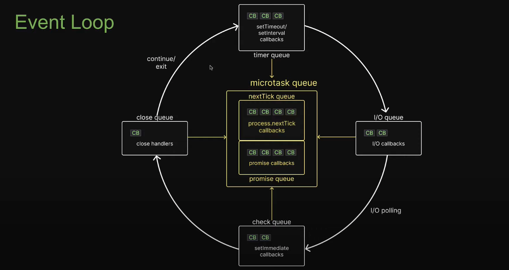
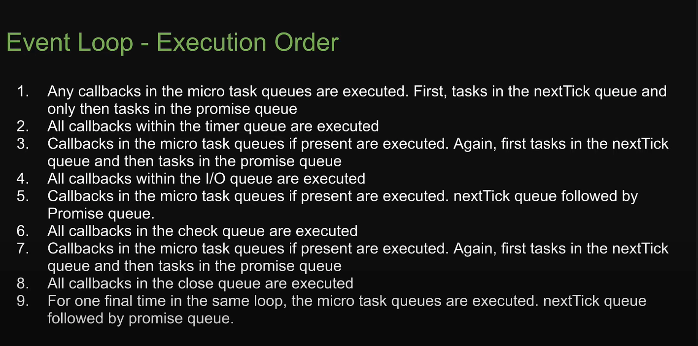
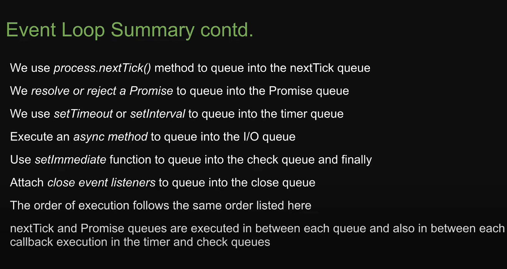

# Findings 

### 1. nextTickQueue is completed and then it switch to Promise callback

### 2. promiseCallback is completed fully then only the program switch to nextTick queue.

### 3. setTimeout C++ code gives a default 1ms time to setTImeout and hence we get some data error.

### 4. 1st time the I/o callback is not calling the callback function it is DOING polling and then after that in the next round the Callback is executed in the I/O callback queue.